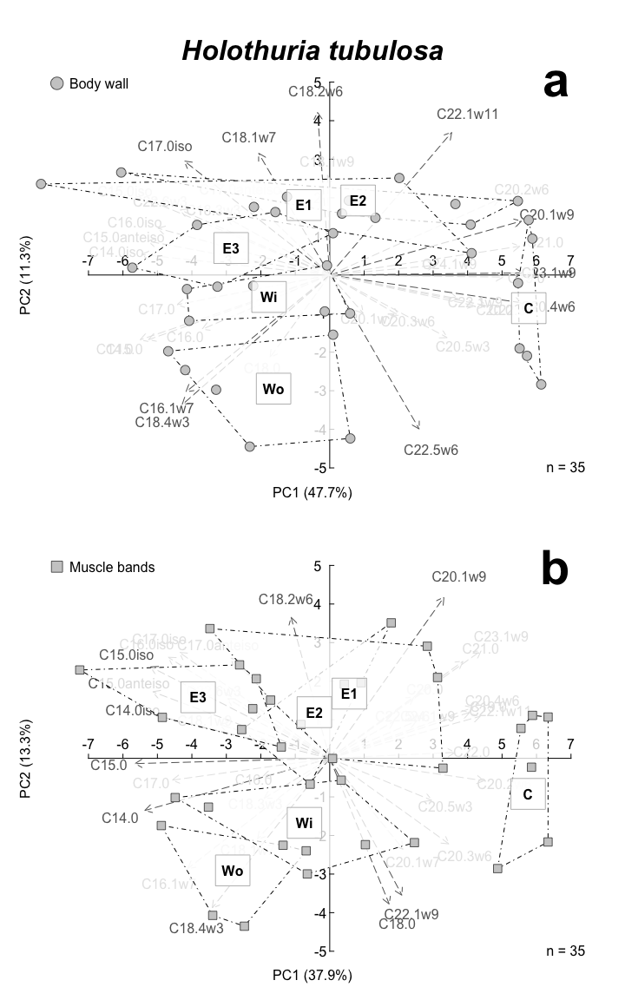

### R Markdown

This R Markdown document is made to support the findings of the paper "Biochemical signatures of Holothuria tubulosa and Holothuria forskali in co-culture with sea bass in the Frioul Islands (France)" by David et al. (2025).

Preparing the toolbox
---------------------

Let's begin by loading the libraries that we will require to run the analyses.

``` r
library(agricolae)
library(vegan)
library(ade4)
library(factoextra)
```

Loading the data
----------------

We load growth, fatty acid and stable isotope data from the GitHub server.

For details on line and column headings please check the readme file.

``` r
growth <- read.csv("https://raw.githubusercontent.com/DAVID-Fk/Sea-cucumber-frioul/main/WeightFrioul.csv", sep=";", header=T)
FA <- read.csv("https://raw.githubusercontent.com/DAVID-Fk/Sea-cucumber-frioul/main/FAFrioul.csv", sep=";", header=T)
SI <- read.csv("https://raw.githubusercontent.com/DAVID-Fk/Sea-cucumber-frioul/main/SIFrioul.csv", sep=";", header=T)
```

Growth and survival
-------------------

``` r
### Let's split the dataset
  
pi=split(growth, growth$Date)$`16/11/21`
pf=split(growth, growth$Date)$`11/10/22`
  
iweight=split(pi$Mass, paste(pi$Exp, pi$Sp))
fweight=split(pf$Mass, paste(pf$Exp, pf$Sp))
        
### Let's build a synthetic table
        
tab1=matrix(data=NA, nrow=length(iweight), ncol=9, dimnames=list(names(iweight), c("Wi mean", "Wi sd", "Wf mean", "Wf sd", "wilcox.test", "SGR", "GR", "RWG", "Survival")))

for (i in 1:length(iweight)) {
    tab1[i, 1]=mean(iweight[[i]])
    tab1[i, 2]=sd(iweight[[i]])
    tab1[i, 3]=mean(fweight[[i]])
    tab1[i, 4]=sd(fweight[[i]])     
    tab1[i, 5]=round(wilcox.test(iweight[[i]], fweight[[i]])$p.value, 3)
    tab1[i, 6]=round(log(mean(fweight[[i]])/mean(iweight[[i]]))/329*100, 3)
    tab1[i, 7]=round((mean(fweight[[i]])-mean(iweight[[i]]))/329, 3)
    tab1[i, 8]=round((mean(fweight[[i]])-mean(iweight[[i]]))/mean(iweight[[i]])*100, 2)
    tab1[i, 9]=round(length(fweight[[i]])/12*100, 1)
    }
```

    ## Warning in wilcox.test.default(iweight[[i]], fweight[[i]]): cannot compute exact
    ## p-value with ties

    ## Warning in wilcox.test.default(iweight[[i]], fweight[[i]]): cannot compute exact
    ## p-value with ties

    ## Warning in wilcox.test.default(iweight[[i]], fweight[[i]]): cannot compute exact
    ## p-value with ties

    ## Warning in wilcox.test.default(iweight[[i]], fweight[[i]]): cannot compute exact
    ## p-value with ties

    ## Warning in wilcox.test.default(iweight[[i]], fweight[[i]]): cannot compute exact
    ## p-value with ties

Fatty acids
-----------

``` r
allFA=FA[-1,-c(1:4, which(colnames(FA)=="C23.0"))]
rownames(allFA)=FA[-1,1]
allFA[is.na(allFA)]=0

## Percentage table
prct=allFA/rowSums(allFA)*100

## Concentrations table 
conc=allFA/FA[-1,which(colnames(FA)=="C23.0")]*FA[-1,which(colnames(FA)=="StdC23")]/FA[-1,which(colnames(FA)=="Splmass")]
conctot=rowSums(conc)
```

### Summary of sediments

``` r
# Let's isolate sediment data

sed=split(prct, substring(rownames(prct), 1, 2))$Se
colMeans(sed)
```

    ##     C14.0iso        C14.0     C15.0iso C15.0anteiso        C15.0     C16.0iso 
    ##   0.72206976   5.40373849   3.02080902   2.78098566   6.12266646   0.78956725 
    ##        C16.0      C16.1w7     C17.0iso C17.0anteiso        C17.0        C18.0 
    ##  26.28966711  24.87905388   0.81417293   0.92323818   1.33041431   4.29110332 
    ##      C18.1w9      C18.1w7      C18.2w6        C19.0      C18.3w3      C18.4w3 
    ##   4.10328799   6.14667465   1.94492581   0.55751230   0.56537432   0.77137407 
    ##        C20.0      C20.1w9      C20.1w7      C20.2w6      C20.3w6        C21.0 
    ##   0.26467002   0.29673775   0.05745698   0.04431603   0.09074844   0.00000000 
    ##      C20.4w6      C20.5w3        C22.0     C22.1w11      C22.1w9      C23.1w9 
    ##   2.27181478   4.30099606   0.12463674   0.15763470   0.15763470   0.00000000 
    ##      C22.5w6      C22.6w3      C24.1w9 
    ##   0.00000000   0.77671831   0.00000000

``` r
sedPr=sed[, colMeans(sed)>0.6]/rowSums(sed[, colMeans(sed)>0.6])*100
  
sedconc=split(conc, substring(rownames(conc), 1, 2))$Se[, colMeans(sed)>0.6]
sedconctot=rowSums(sedconc)
waerden.test(sedconctot, substring(names(sedconctot), 8, 10), console=T)
```

    ## 
    ## Study: sedconctot ~ substring(names(sedconctot), 8, 10)
    ## Van der Waerden (Normal Scores) test's
    ## 
    ## Value : 12.85881
    ## Pvalue: 0.004952107
    ## Degrees of Freedom:  3 
    ## 
    ## substring(names(sedconctot), 8, 10),  means of the normal score
    ## 
    ##    sedconctot       std r
    ## C   1.0657721 0.4260527 5
    ## E1 -0.8042747 0.6866840 5
    ## E2  0.2319592 0.4475282 4
    ## E3 -0.4470647 0.4572673 5
    ## 
    ## Post Hoc Analysis
    ## 
    ## Groups according to probability of treatment differences and alpha level( 0.05 )
    ## 
    ## Treatments with the same letter are not significantly different.
    ## 
    ## Means of the normal score
    ## 
    ##         score groups
    ## C   1.0657721      a
    ## E2  0.2319592      b
    ## E3 -0.4470647     bc
    ## E1 -0.8042747      c

``` r
# Let's edit a summary table
  
summarySed=data.frame(M=aggregate(cbind(sedPr, sedconctot) , by=list(substring(names(sedconctot), 8, 10)), mean), SD=aggregate(cbind(sedPr, sedconctot), by=list(substring(names(sedconctot), 8, 10)),sd), LE=aggregate(cbind(sedPr, sedconctot), by=list(substring(names(sedconctot), 8, 10)),length))
```

### Graphical representation


Note that the figure was further modified with a vectorial graphics editor to avoid labels superposition

### Summary of sea cucumbers

``` r
# Let's isolate sea cucumbers data

seacu=prct[-c(which(substring(rownames(prct), 1, 2)=="Se")),]
totFA=rowSums(conc[-c(which(substring(rownames(prct), 1, 2)=="Se")),])

# Let's define categories of FA
  
brFA=rowSums(seacu[, c(which(colnames(seacu)=="C15.0iso"), which(colnames(seacu)=="C15.0anteiso"), which(colnames(seacu)=="C16.0iso"))])
SFA=rowSums(seacu[, c(which(colnames(seacu)=="C14.0"), which(colnames(seacu)=="C15.0"), which(colnames(seacu)=="C16.0"), which(colnames(seacu)=="C18.0"), which(colnames(seacu)=="C19.0"),which(colnames(seacu)=="C20.0"), which(colnames(seacu)=="C21.0"), which(colnames(seacu)=="C22.0"), which(colnames(seacu)=="C24.0"))])
PUFA=rowSums(seacu[, c(which(colnames(seacu)=="C18.2w6"), which(colnames(seacu)=="C18.3w3"), which(colnames(seacu)=="C18.4w3"), which(colnames(seacu)=="C20.2w6"), which(colnames(seacu)=="C20.4w6"), which(colnames(seacu)=="C20.5w3"), which(colnames(seacu)=="C22.5w6"), which(colnames(seacu)=="C22.6w3"))])
HUFA=rowSums(seacu[, c(which(colnames(seacu)=="C20.4w6"), which(colnames(seacu)=="C20.5w3"), which(colnames(seacu)=="C22.5w6"), which(colnames(seacu)=="C22.6w3"))])
w3=rowSums(seacu[, c(which(colnames(seacu)=="C18.3w3"), which(colnames(seacu)=="C18.4w3"), which(colnames(seacu)=="C20.5w3"), which(colnames(seacu)=="C22.6w3"))])
w6=rowSums(seacu[, c(which(colnames(seacu)=="C18.2w6"), which(colnames(seacu)=="C20.2w6"), which(colnames(seacu)=="C20.4w6"), which(colnames(seacu)=="C22.5w6"))], na.rm=T)
LCMUFA=rowSums(seacu[, c(which(colnames(seacu)=="C20.1w9"), which(colnames(seacu)=="C20.1w7"), which(colnames(seacu)=="C22.1w11"), which(colnames(seacu)=="C22.1w9"), which(colnames(seacu)=="C23.1w9"), which(colnames(seacu)=="C24.1w9"))])
MUFA=rowSums(seacu[, c(which(colnames(seacu)=="C16.1w7"), which(colnames(seacu)=="C18.1w9"), which(colnames(seacu)=="C18.1w7"), which(colnames(seacu)=="C20.1w9"), which(colnames(seacu)=="C20.1w7"), which(colnames(seacu)=="C22.1w11"), which(colnames(seacu)=="C22.1w9"), which(colnames(seacu)=="C23.1w9"), which(colnames(seacu)=="C24.1w9"))])

# Let's edit a summary table

summaryFA=data.frame(M=aggregate(cbind(seacu, brFA, SFA, MUFA, LCMUFA, PUFA, HUFA, w3, w6, totFA) , by=list(substring(rownames(seacu), 1, 2)), mean), SD=aggregate(cbind(seacu, brFA, SFA, MUFA, LCMUFA, PUFA, HUFA, w3, w6, totFA), by=list(substring(rownames(seacu), 1, 2)),sd), LE=aggregate(cbind(seacu, brFA, SFA, MUFA, LCMUFA, PUFA, HUFA, w3, w6, totFA), by=list(substring(rownames(seacu), 1, 2)),length))
```

### Principal Component Analysis of fatty acid compositions of sea cucumbers

#### Holothuria tubulosa



Note that the figure was further modified with a vectorial graphics editor to avoid labels superposition

#### Holothuria forskali


Note that the figure was further modified with a vectorial graphics editor to avoid labels superposition

Stable isotopes
---------------

### Graphical representation (biplot 13C-15N)


